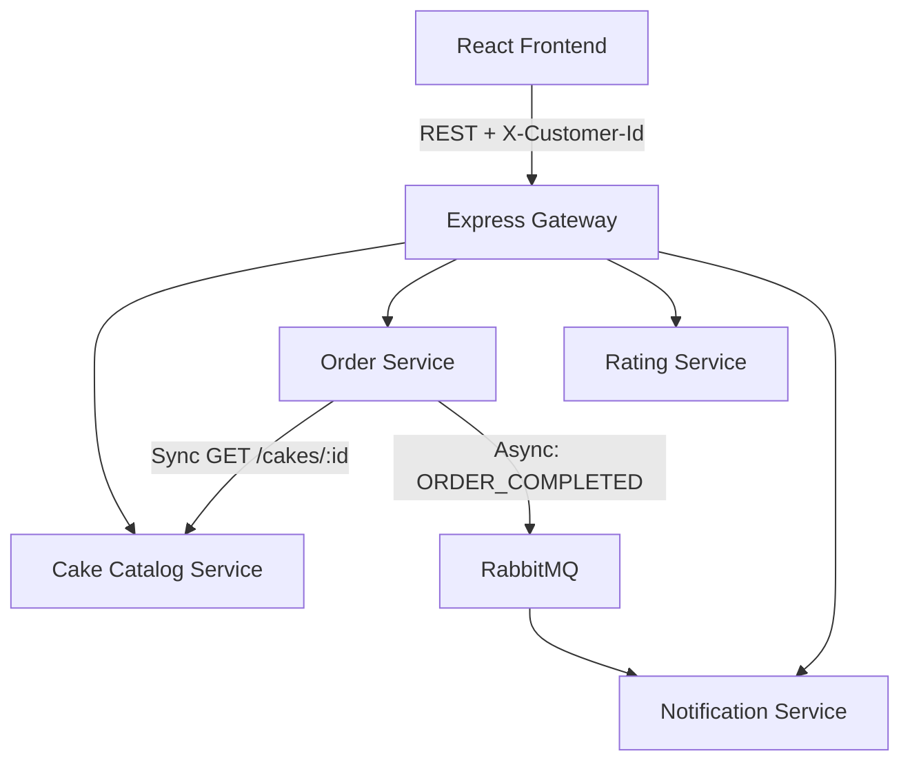

# Cake Delight

## 1. Project Overview

Cake Delight is a cloud-native microservices-based cake ordering application being developed as a capstone training project.

## 2. Project Objectives

The primary purpose of this project is to demonstrate:
- microservices architecture
- independently deployable services
- REST API communication
- event-driven communication
- database-backed persistence
- Docker containerization
- Kubernetes orchestration
- end-to-end customer journey

## 3. Functional Scope

The required user capabilities include:
- browse cakes
- filter cakes by name/category/price range
- add cakes to basket
- view/update/remove basket items
- checkout/create order
- rate cakes
- receive order confirmation notification

## 4. Architecture Overview

*Note: MongoDB will serve as the local persistence layer. The application does not implement authentication. An anonymous customer/client UUID is generated by the frontend and persisted in localStorage. The UUID is sent through the X-Customer-Id header so that the Order and Notification services can associate application data with the same client.*

### Communication Paths & Price Snapshot Assumption
- **External Client Communication**: React Frontend → Express Gateway → Microservice
- **Internal Synchronous Service Communication**: Order Service → Catalog Service via REST (direct, bypassing Gateway)
- **Asynchronous Communication**: Order Service → RabbitMQ → Notification Service

*MVP Price Snapshot Assumption*: When adding a cake to the basket, the Order Service directly calls the Catalog Service (`GET /cakes/:id`) to validate existence and availability. If valid, the Order Service stores the cake's name and current price as a snapshot inside the basket item. Checkout uses the price stored in the basket. For this MVP, if a catalog price changes after a cake has been added to a basket, the existing basket item continues using its stored price snapshot.

## 5. Technology Stack

- **Frontend**: React, Plain CSS
- **Backend**: Node.js, Express.js
- **API Gateway**: Express Gateway
- **Database**: MongoDB
- **Messaging**: RabbitMQ
- **Containerization**: Docker, Docker Hub
- **Orchestration**: Kubernetes, Minikube
- **Version Control & CI/CD**: Git, GitHub, GitHub Actions (to be implemented in a later phase)

## 6. Microservices

### Cake Catalog Service
Owns cake catalog data, metadata, pricing, and availability.

### Order Service
Owns basket and order functionality.

### Rating Service
Owns cake ratings and average ratings.

### Notification Service
Consumes order completion events and manages in-app notifications.

## 7. Data Architecture

Logical database ownership mapping:
- `cake_catalog_db` owned by Catalog Service
- `order_db` owned by Order Service
- `rating_db` owned by Rating Service
- `notification_db` owned by Notification Service

One local MongoDB instance will be used. Demo/initial data will be created through an idempotent seeding mechanism rather than manual entry.

## 8. Containerization and Deployment

The application will eventually be:
- containerized using Docker
- deployed using Kubernetes
- run through Minikube
- deployed on the company-provided training VM

## 9. Development Phases

1. Repository and project foundation
2. Architecture/data/API contracts
3. Cake Catalog Service
4. Order Service
5. Rating Service
6. Notification Service + RabbitMQ
7. Express Gateway
8. React Frontend
9. Complete local end-to-end integration
10. Dockerization
11. Docker integration
12. Kubernetes + Minikube
13. Kubernetes end-to-end testing
14. Docker Hub
15. GitHub Actions CI/CD
16. Final documentation/demo/ZIP submission

## 10. Scope Boundaries

Explicitly **NOT** included in this MVP:
- authentication / JWT
- user service
- payment service
- external image storage
- MongoDB Atlas / AWS / external cloud database
- email/SMS provider
- Kafka / Redis
- service mesh
- automated testing
- advanced DDD / CQRS / event sourcing
- production-grade HA
- Kubernetes persistent volumes for this MVP

This project intentionally focuses on the minimum implementation required to demonstrate the specified cloud-native microservices concepts.

## 11. Documentation

Detailed documentation will be maintained throughout development within the `docs/` directory and this README, updated iteratively during each phase rather than postponed until the end.
