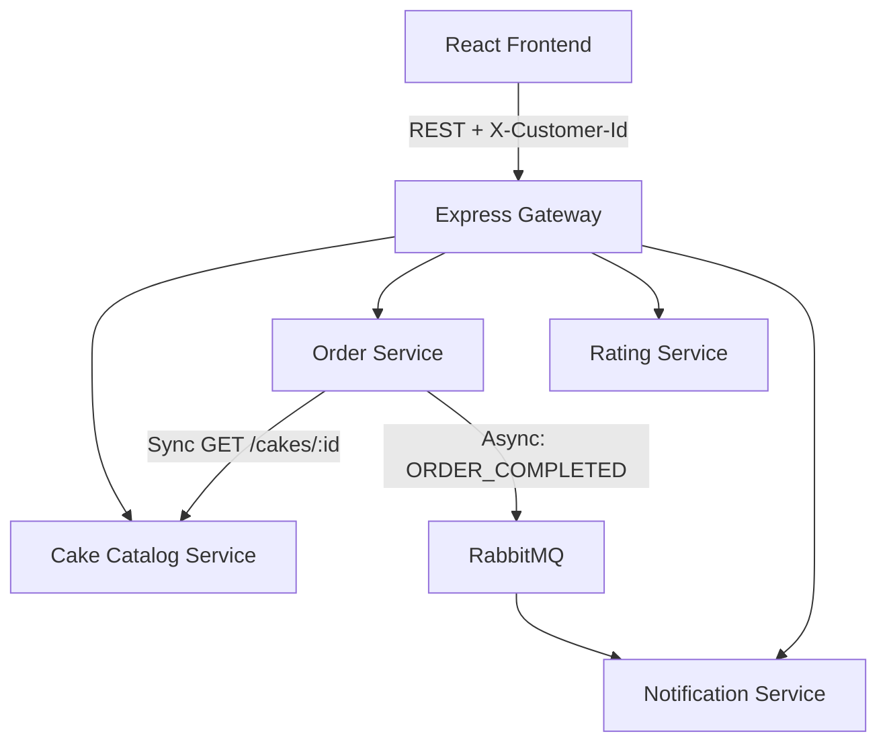

# Cake Delight

## 1. Project Overview

Cake Delight is a cloud-native microservices-based cake ordering application developed as a capstone training project.

---

## 🚀 Quick Start / Deployment Instructions

### Prerequisites
- **Docker Desktop** (running)
- **kubectl** (`winget install -e --id Kubernetes.kubectl`)
- **Minikube** (`winget install -e --id Kubernetes.minikube`)

---

### Option A: Kubernetes (Minikube) Deployment

If anyone unzips or clones this repository, they can run the entire 8-workload microservice stack on Minikube in 4 simple steps:

```bash
# Clone the repository
git clone https://github.com/Gautam-00/GauravRauniyar_CapstoneProject_Cohort1.git
cd GauravRauniyar_CapstoneProject_Cohort1

# Step 1: Start Minikube
minikube start --driver=docker

# Step 2: Deploy all Kubernetes Manifests
kubectl apply -f k8s/ --recursive

# Step 3: Check Pod status (wait ~30-45s for images to pull from Docker Hub)
kubectl get pods -n cake-delight

# Step 4: Port forward to access via browser
kubectl port-forward svc/frontend 5173:80 -n cake-delight
kubectl port-forward svc/gateway 3000:3000 -n cake-delight
```

Open **`http://localhost:5173`** in your browser!

---

### Option B: Docker Compose Deployment

To run from source code locally using Docker Compose:

```bash
# Build and start all 8 containers
docker compose up --build -d

# View status & logs
docker compose ps
docker compose logs -f

# Stop application
docker compose stop
```

Open **`http://localhost:5173`** in your browser!

---

## 2. Architecture Overview



*Note: MongoDB serves as the local persistence layer. The application uses anonymous customer/client UUIDs sent through the `X-Customer-Id` header so that Order and Notification services associate application data with the same client.*

---

## 3. Technology Stack

- **Frontend**: React, Plain CSS, Nginx
- **Backend**: Node.js, Express.js
- **API Gateway**: Express Gateway
- **Database**: MongoDB
- **Messaging**: RabbitMQ (AMQP)
- **Containerization**: Docker, Docker Hub (`nemo0110/cake-delight-*:v1.0.0`)
- **Orchestration**: Kubernetes, Minikube
- **Version Control & CI/CD**: Git, GitHub, GitHub Actions

---

## 4. Public Docker Hub Registry

Six prebuilt custom application images are published publicly on Docker Hub under user `nemo0110`:

- `nemo0110/cake-delight-frontend:v1.0.0`
- `nemo0110/cake-delight-gateway:v1.0.0`
- `nemo0110/cake-delight-catalog-service:v1.0.0`
- `nemo0110/cake-delight-order-service:v1.0.0`
- `nemo0110/cake-delight-rating-service:v1.0.0`
- `nemo0110/cake-delight-notification-service:v1.0.0`

---

## 5. Documentation

Detailed documentation is available in `docs/`:
- [Deployment Guide](docs/deployment.md)
