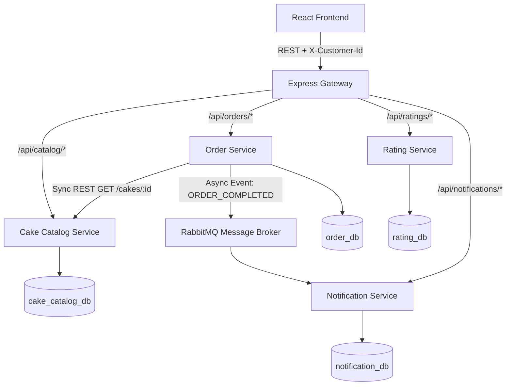
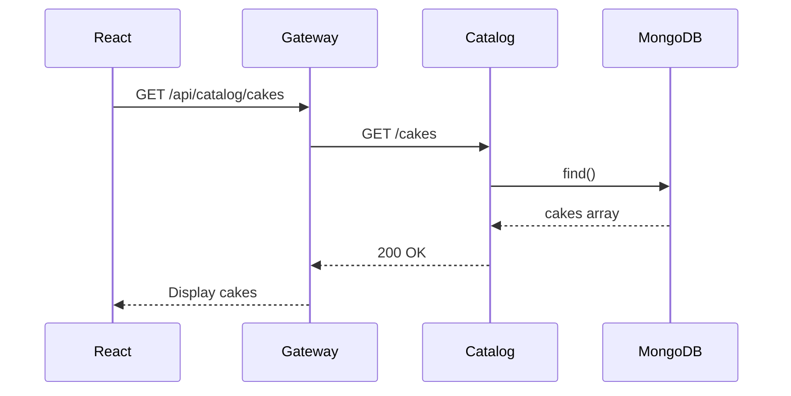
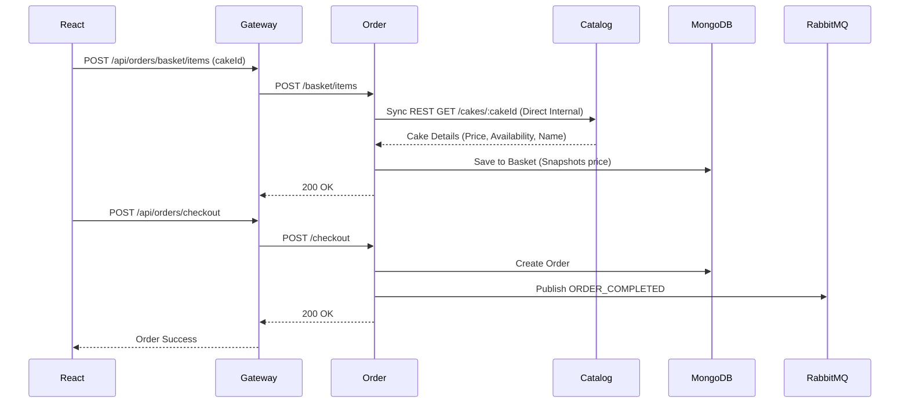
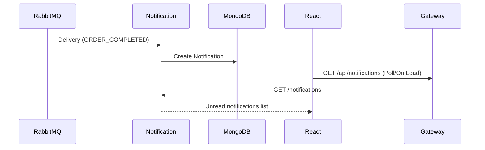

# Architecture

## 1. System Overview
Cake Delight is a minimal cloud-native microservices application. It consists of a React frontend, an Express API Gateway, and four distinct Node.js backend services. Data is persisted in local MongoDB instances logically separated per service.

Communication paths are strictly defined:
- **External Client Communication**: React Frontend → Express Gateway → Microservice
- **Internal Synchronous Service Communication**: Order Service → Catalog Service via REST
- **Asynchronous Communication**: Order Service → RabbitMQ → Notification Service

## 2. Component Diagram

## 3. Service Boundaries
- **Cake Catalog Service**: Manages cake catalog data, metadata, pricing, and availability.
- **Order Service**: Manages user baskets, items, quantities, and the checkout process. Depends on the Catalog Service to fetch trusted pricing and details when adding to a basket.
- **Rating Service**: Manages cake ratings and calculates averages. Completely independent of other services.
- **Notification Service**: Listens for checkout events and manages in-app notifications for the user.

*Anonymous Customer/Client Identification*: The application does not implement authentication. An anonymous customer/client UUID is generated by the frontend and persisted in localStorage. The UUID is sent through the X-Customer-Id header so that the Order and Notification services can associate application data with the same client.

## 4. End-to-End Flows

### FLOW A — Browse Cakes

### FLOW C & D — Basket & Checkout

*MVP Price Snapshot Assumption*: During the basket add operation, the Order Service synchronously calls the Catalog Service to validate the cake and fetch the trusted current price. This price is snapshotted into the basket item. Checkout uses this snapshotted price. For this MVP, if the catalog price changes later, the existing basket item retains its snapshotted price.

### Async Flow — Notification

